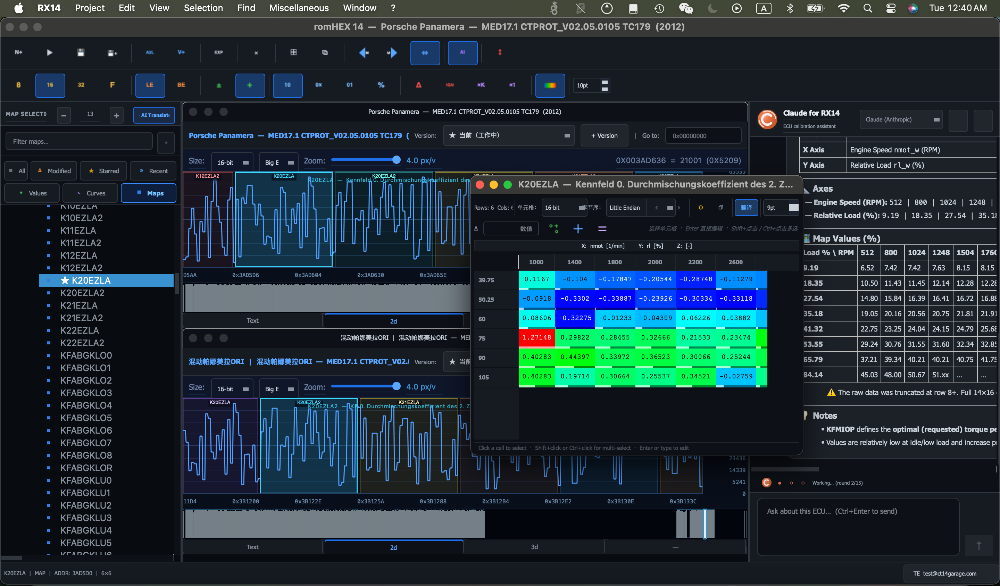

# romHEX 14

### 全球首款 AI 驱动 ECU 标定软件

 

  

**专业 ECU 调校软件，完整支持 A2L/HEX，30+ AI 工具，兼容 WinOLS 工作流程。**

 

[**下载最新版本**](https://github.com/ctabuyo/romHEX14-ECU-Tuning/releases/latest)&nbsp;&nbsp;·&nbsp;&nbsp;[**官方网站**](https://romhex14.com)&nbsp;&nbsp;·&nbsp;&nbsp;[**使用文档**](https://romhex14.com/docs)&nbsp;&nbsp;·&nbsp;&nbsp;[**English**](README.md)

---

 

 

*MAP 编辑器支持 2D/3D 可视化、AI 助手、十六进制视图及多语言标签翻译*

---

 

## 下载

| 平台 | 下载 | 说明 |
|:---:|:---:|:---|
|  | [**RX14-Setup.exe**](https://github.com/ctabuyo/romHEX14-ECU-Tuning/releases/latest/download/RX14-Setup.exe) | Windows 10/11 (64位) — 单文件安装程序 |
|  | [**RX14.dmg**](https://github.com/ctabuyo/romHEX14-ECU-Tuning/releases/latest/download/RX14.dmg) | macOS 12+（Apple Silicon 和 Intel） |
|  | [**RX14.AppImage**](https://github.com/ctabuyo/romHEX14-ECU-Tuning/releases/latest/download/RX14.AppImage) | Ubuntu 22.04+、Fedora 38+、Arch |

> **中国用户：** 如果 GitHub 下载速度慢，应用程序在检查更新时会自动提供镜像下载链接。

 

## 功能特色

**A2L 和 HEX 引擎**
- 完整的 ASAP2 (A2L) 解析器，支持特性曲线、轴线和测量值
- HEX/BIN/S19 文件加载，自动识别 ECU
- 并排 ROM 对比，字节级差异可视化

**AI 助手** — *行业首创*
- 30+ 专用 ECU 标定 AI 工具
- 智能 MAP 识别与标注
- AI 驱动的跨语言 MAP 标签翻译
- 自然语言查询标定数据

**MAP 编辑器**
- 交互式 2D/3D MAP 可视化
- 拖拽编辑，实时预览
- MAP 包导入/导出，方便分享标定
- 补丁创建与管理（.rxpatch）

**项目管理**
- 多文件项目，支持关联 ROM
- 项目注册表，快速访问
- 自动保存，崩溃恢复
- 完整的撤销/重做历史

**多语言支持**
- 英语、西班牙语、中文（简体）、泰语
- AI 驱动的 MAP 标签跨语言翻译

 

## 支持的 ECU

| 制造商 | ECU 系列 |
|---|---|
| **博世 (Bosch)** | MED17、MG1、MD1、EDC17、EDC16、EDC15、ME7、ME9、MED9、MSV、MSD |
| **马牌 (Continental)** | SIMOS 12/16/18/19/22、SID、SCG、SCM |
| **德尔福 (Delphi)** | DCM3.x、DCM6.x、DCU-10x |
| **电装 (Denso)** | 多代产品 |
| **玛涅蒂·马瑞利 (Magneti Marelli)** | MJD、7GV/8GMK |
| **法雷奥 (Valeo)** | VD46 |

 

## 系统要求

| | 最低配置 | 推荐配置 |
|---|---|---|
| **操作系统** | Windows 10 / macOS 12 / Ubuntu 22.04 | Windows 11 / macOS 14 / 最新 LTS |
| **内存** | 4 GB | 8 GB |
| **硬盘** | 500 MB | 1 GB |
| **显示器** | 1280 x 720 | 1920 x 1080 |

 

## 安装说明

**Windows** — 下载 `RX14-Setup.exe` 并运行。单文件安装程序，无需任何依赖。

**macOS** — 下载 `RX14.dmg`，打开后将 romHEX 14 拖入"应用程序"文件夹。

**Linux** — 下载 `RX14.AppImage`，添加执行权限（`chmod +x`），然后运行。

 

## 许可证

本软件基于 [GNU 宽松通用公共许可证 v3.0](https://www.gnu.org/licenses/lgpl-3.0.html) (LGPL-3.0) 分发。

基于 [Qt 框架](https://www.qt.io/)（LGPL）构建。

Copyright (c) 2024-2026 CT14 Garage Co., Ltd. 版权所有。

 

---

由 <b>CT14 Garage</b> 精心打造 — 专业 ECU 标定解决方案

